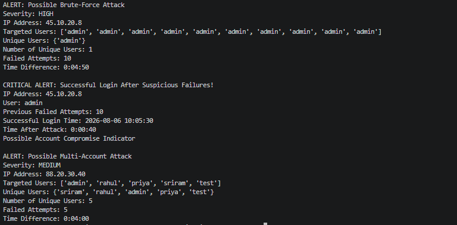

# 🛡️ Authentication log analyzer

Authentication Log Analyzer is a Python-based authentication log analysis and threat detection tool designed to identify suspicious login behavior from authentication logs.

It analyzes failed and successful authentication events, detects suspicious activity within configurable time windows, classifies attack patterns, assigns severity levels, and correlates successful logins that occur shortly after suspicious failures.

## 🔍 Features

- Authentication log parsing
- Input validation for malformed log entries
- Invalid timestamp handling
- Failed and successful login tracking
- Time-window based attack detection
- Brute-force attack detection
- Multi-account attack detection
- Severity classification
- Successful-login correlation
- Possible account compromise detection
- Duplicate alert prevention
- Modular Python functions

## 🚨 Detection Capabilities

### Brute-Force Detection

Authentication Log Analyzer detects repeated failed authentication attempts against the same account from the same IP address.

Example:

```text
45.10.20.8
→ 10 failed attempts
→ Target: admin
→ Within 10 minutes
→ Possible Brute-Force Attack
```

### Multi-Account Detection

Authentication Log Analyzer can identify a source IP generating failed authentication attempts against multiple user accounts.

Example:

```text
88.20.30.40
→ admin
→ rahul
→ priya
→ sriram
→ test
→ Possible Multi-Account Attack
```

### Successful Login Correlation

After detecting suspicious failures, AuthWatch checks whether one of the targeted accounts successfully authenticates from the same IP shortly afterward.

Example:

```text
10 failed attempts against admin
        ↓
Brute-force activity detected
        ↓
admin successfully logs in
        ↓
40 seconds after the failures
        ↓
Possible Account Compromise Indicator
```

## ⚠️ Severity Levels

Authentication Log Analyzer currently assigns severity according to the number of failed attempts:

| Failed Attempts | Severity |
|---|---|
| 5–9 | MEDIUM |
| 10–19 | HIGH |
| 20+ | CRITICAL |

The minimum detection threshold is currently **5 failed attempts within 10 minutes**.

## ⏱️ Detection Windows

```text
Attack Detection Window: 10 minutes
Successful Login Correlation Window: 15 minutes
```

A successful login is correlated only when:

- It occurs after the suspicious failed attempts.
- It occurs within the configured correlation window.
- The successful account was one of the accounts targeted during the suspicious activity.
- The successful login originates from the same IP address.

## 📄 Supported Log Format

Authentication Log Analyzer currently expects authentication events in the following format:

```text
YYYY-MM-DD HH:MM:SS EVENT user=<username> ip=<ip_address>
```

Example:

```text
2026-08-06 10:00:00 LOGIN_FAILED user=admin ip=45.10.20.8
2026-08-06 10:05:30 LOGIN_SUCCESS user=admin ip=45.10.20.8
```

Supported events:

```text
LOGIN_FAILED
LOGIN_SUCCESS
```

## 🧠 How It Works

```text
Authentication Log
        ↓
Log Parser
        ↓
Input Validation
        ↓
Authentication Event Storage
        ↓
Time-Window Analysis
        ↓
Threshold Detection
        ↓
Attack Classification
        ↓
Severity Calculation
        ↓
Successful Login Correlation
        ↓
Security Alert
```

## 🧩 Main Components

The project separates major responsibilities into dedicated functions:

```text
parse_log_line()
→ validates and parses authentication log entries

calculate_severity()
→ determines alert severity

determine_attack_type()
→ classifies suspicious authentication behavior

find_correlated_success()
→ correlates successful logins with previous suspicious failures
```

## 🧪 Testing

Authentication Log Analyzer v1 was manually tested against several scenarios:

- Normal authentication activity
- Exact detection-threshold boundary
- Failed attempts outside the detection window
- Brute-force behavior
- Multi-account behavior
- Successful login after suspicious failures
- Successful login involving a non-targeted account
- Malformed authentication entries
- Invalid timestamps

## ▶️ Running AuthWatch

### Requirements

- Python 3
- No external Python packages are required

### Run

Place the authentication data inside:

```text
auth.log
```

Then execute:

```bash
python main.py
```

## 📂 Project Structure

```text
Authentication Log Analyzer/
│
├── main.py
├── auth.log
└── README.md
```

## 📊 Example Detection

```text
ALERT: Possible Brute-Force Attack
Severity: HIGH
IP Address: 45.10.20.8
Failed Attempts: 10
Time Difference: 0:04:50

CRITICAL ALERT: Successful Login After Suspicious Failures!
IP Address: 45.10.20.8
User: admin
Previous Failed Attempts: 10
Successful Login Time: 2026-08-06 10:05:30
Time After Attack: 0:00:40
Possible Account Compromise Indicator
```

## 📸 AuthWatch Demo

Below is an example of AuthWatch detecting suspicious authentication activity:



## ⚠️ Current Limitations

Authentication Log Analyzer v1 is a learning and portfolio project rather than a production SIEM or enterprise security platform.

Current limitations include:

- File-based log ingestion
- Custom authentication log format
- Rule-based detection
- In-memory event storage
- No persistent database
- No real-time streaming pipeline
- No web dashboard
- No external threat-intelligence enrichment

## 🚀 Future Roadmap

Possible Authentication Log Analyzer v2 improvements include:

- Real-time log monitoring
- Multiple log-source support
- JSON log ingestion
- Configuration files
- Persistent alert storage
- Additional authentication attack detections
- Automated unit tests
- Structured logging
- REST API
- Security dashboard
- Docker support
- IP enrichment
- Alert deduplication and management
- SIEM-compatible export

## 🎯 Project Purpose

Authentication Log Analyzer was built to develop practical experience with:

- Python
- Authentication security
- Log analysis
- Detection engineering
- Time-based event correlation
- Input validation
- Defensive programming
- Modular software design

## 👨‍💻 Author

**Sriram**

Cybersecurity Student